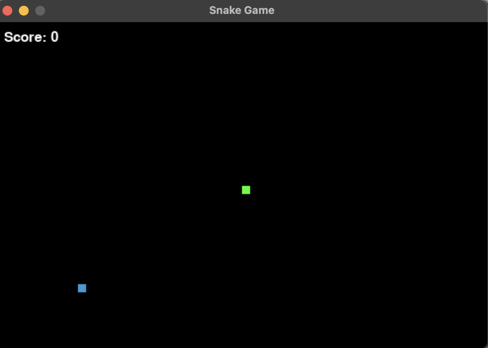

# Snake Game in Python

This project is a simple implementation of the classic Snake game using Python and the `pygame` library.

---

## 📦 Requirements
- Python 3.x
- pygame (`pip install pygame`)

---

## 🚀 How to Run
1. Make sure you have Python installed.
2. Install pygame:
```bash
pip install pygame
```
3. Run the script:
```bash
python snake_game.py
```

---

## 🕹️ Game Controls
- **Arrow Keys**: Control the snake (Up, Down, Left, Right)
- **Q**: Quit after game over
- **C**: Continue playing after game over

---

## 🧠 How it Works

### Game Setup
- **Screen Size**: 600x400 pixels
- **Snake Block Size**: 10 pixels
- **Snake Speed**: 15 frames per second

### Main Components

- **Snake Movement**: The snake moves in a direction based on arrow key input. Movement is controlled with `dx` and `dy` variables.

- **Food Generation**: Food appears randomly within the game window. When the snake eats the food (collides with it), the snake grows in length.

- **Collision Detection**:
  - With walls: If the snake's head goes out of bounds, the game ends.
  - With itself: If the snake's head touches any part of its body, the game ends.

- **Score Keeping**: The score is calculated based on the length of the snake. Displayed at the top-left corner.

### Main Functions
- `game_loop()`: Runs the core game loop, handles events, game logic, and rendering.
- `draw_snake()`: Draws the snake using rectangles.
- `display_score()`: Displays the current score.

---

## 🖼️ Screenshot



---

## 📄 File Structure
```
main.py
README.md
screenshot.png
```

---

## ✅ To Do (Optional Enhancements)
- Add levels and increasing speed
- Add sound effects
- Add a leaderboard or high score tracker
- Add graphical assets

---

## 🧑‍💻 Author - Manupendra Tiwari
Created with 💚 using Python and pygame.

Feel free to improve or fork this project!

